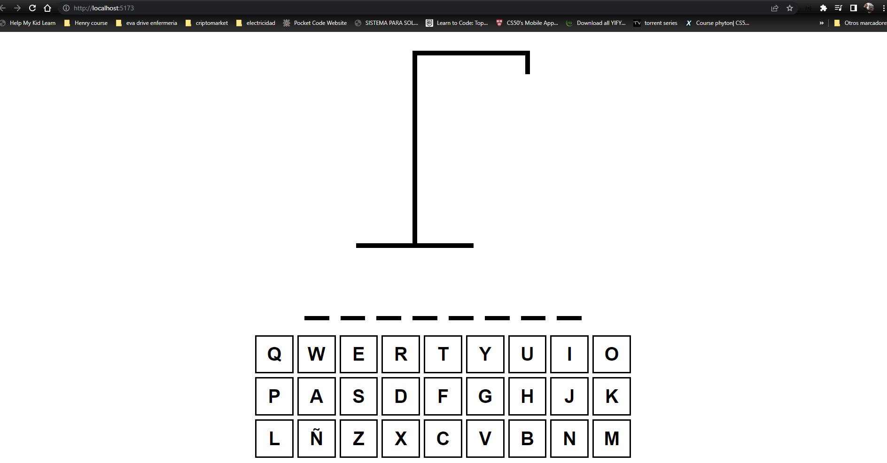
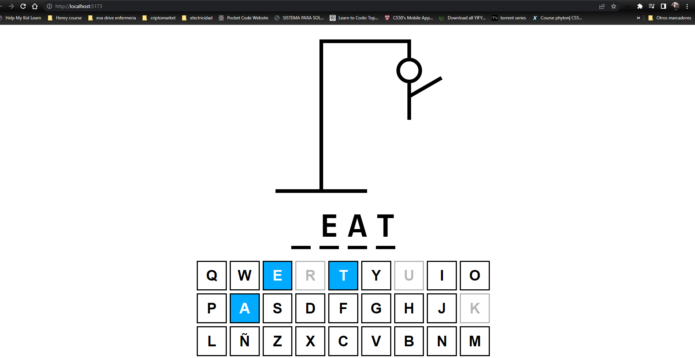
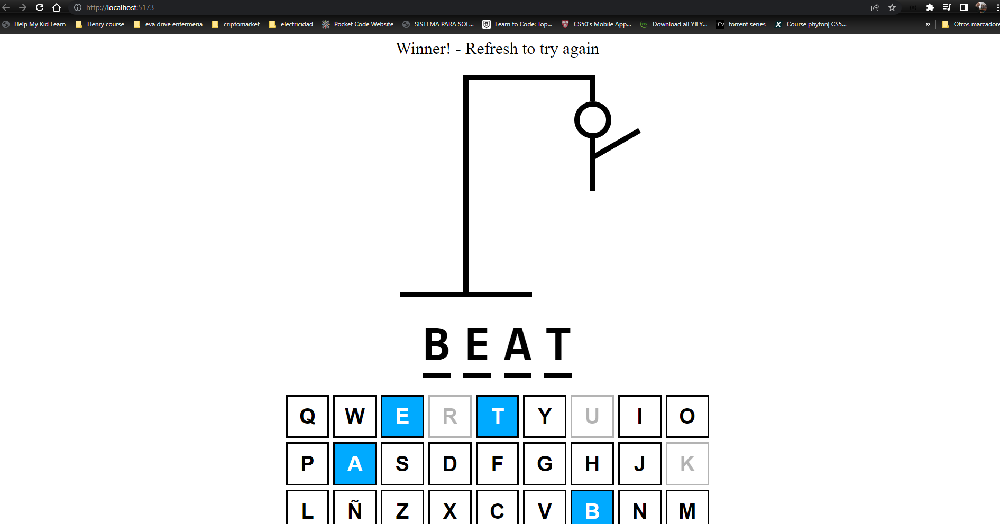
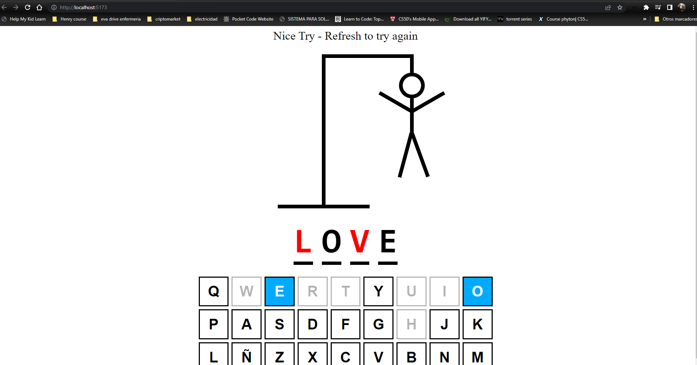

# hangMan
## Basic app for practice, is the popular game "hangMan" with words in English (is a FrondEnd app)
# run and install the game
# 1º Do npm install
# 2º npm run dev
# Enjoy.
## some screenShots
 

 

 

 

